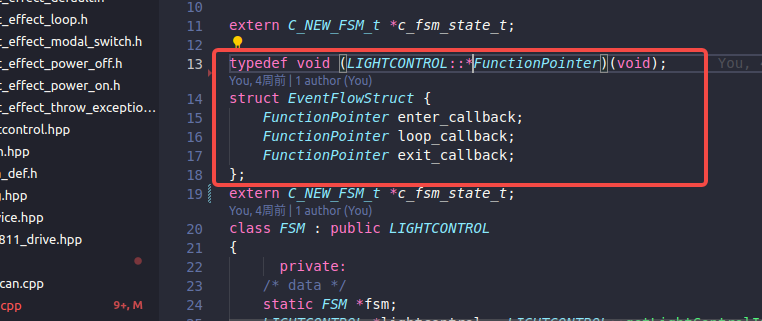
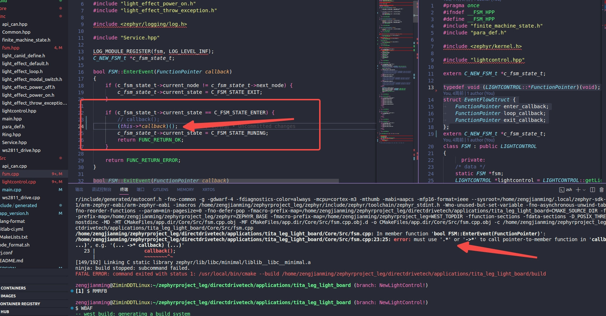
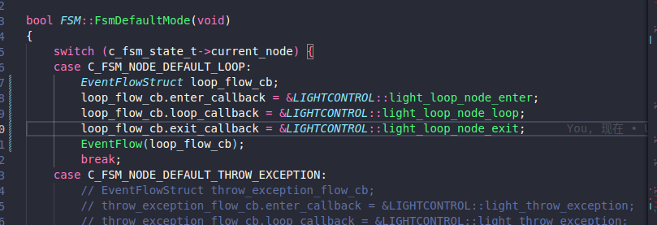
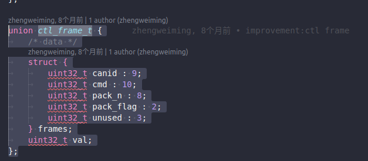
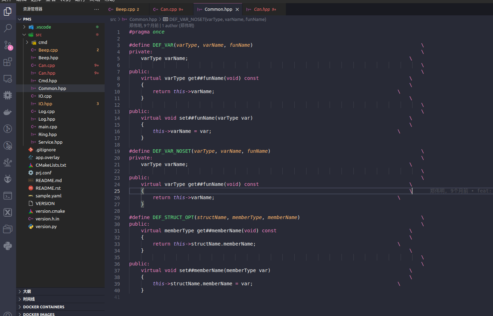

# C++记录

[TOC]


# 回调函数







C++回调函数可以按照如上写，上述代码实现了一个输入参数为三个回调函数指针的触发函数，将按照函数逻辑调用回调。

# 数组大小动态变化

描述一个简单的能动态变化数组大小的方法

```c
#include <stdio.h>
#include <stdint.h>
#include <stdlib.h>

void main(){
	
	int* dynamicArray = NULL;
	int size = 0;
	int capacity = 1;

	for(int i = 0; i < 10; i++){
		int* temp = (int*)realloc(dynamicArray, capacity * sizeof(int));
		if(temp	== NULL){
			printf("realloc failed\r\n");
			free(dynamicArray);
			return;
		}
		dynamicArray = temp;
		
        //如果没有下面这一步，则dynamicArray只会改变数组大小，但元素的值不变
		dynamicArray[size] = i;
		size++;
		capacity++;

		for(int j = 0; j < size; j++){
				printf("dynamicArray[%d]: %d\r\n", j,dynamicArray[j]);
		}
		printf("-----------------------------------\r\n");
		printf("\n");
	}
}
```

输出结果表现为

```bash
dynamicArray[0]: 0
-----------------------------------

dynamicArray[0]: 0
dynamicArray[1]: 1
-----------------------------------

dynamicArray[0]: 0
dynamicArray[1]: 1
dynamicArray[2]: 2
-----------------------------------

dynamicArray[0]: 0
dynamicArray[1]: 1
dynamicArray[2]: 2
dynamicArray[3]: 3
-----------------------------------

dynamicArray[0]: 0
dynamicArray[1]: 1
dynamicArray[2]: 2
dynamicArray[3]: 3
dynamicArray[4]: 4
-----------------------------------

dynamicArray[0]: 0
dynamicArray[1]: 1
dynamicArray[2]: 2
dynamicArray[3]: 3
dynamicArray[4]: 4
dynamicArray[5]: 5
-----------------------------------

dynamicArray[0]: 0
dynamicArray[1]: 1
dynamicArray[2]: 2
dynamicArray[3]: 3
dynamicArray[4]: 4
dynamicArray[5]: 5
dynamicArray[6]: 6
-----------------------------------

dynamicArray[0]: 0
dynamicArray[1]: 1
dynamicArray[2]: 2
dynamicArray[3]: 3
dynamicArray[4]: 4
dynamicArray[5]: 5
dynamicArray[6]: 6
dynamicArray[7]: 7
-----------------------------------

dynamicArray[0]: 0
dynamicArray[1]: 1
dynamicArray[2]: 2
dynamicArray[3]: 3
dynamicArray[4]: 4
dynamicArray[5]: 5
dynamicArray[6]: 6
dynamicArray[7]: 7
dynamicArray[8]: 8
-----------------------------------

dynamicArray[0]: 0
dynamicArray[1]: 1
dynamicArray[2]: 2
dynamicArray[3]: 3
dynamicArray[4]: 4
dynamicArray[5]: 5
dynamicArray[6]: 6
dynamicArray[7]: 7
dynamicArray[8]: 8
dynamicArray[9]: 9
-----------------------------------
```

不建议在单片机上使用动态数组，单片机没有完整的动态内存分配函数（malloc 和 free），甚至完全没有或是虚假的，因此使用动态数组本身就有风险，其次单片机在硬件上没有MMU（内存管理单元），不能对内存碎片做收集和管理以及再映射。而在zephyr RTOS中，具有MMU的系统被视为具有无限数量可编程区域的MPU。

但是RTOS是存在针对单片机的软件内存调度，例如HEAP等，也可以自己创建数个大数组来管理自己的数据内存管理。

但是通常来说单片机不太容易自由的创建动态数组，一种简单的实现方式是直接创建一个相对足够大的连续空间的数组，另外声明一个整形数去计当前数组实际被占用了多少个元素即可（但这种方法难以在接收未知数量数据的情境下使用，但通常来说此时建议使用环形缓冲区）


# 关于union的使用

有关union的定义，在百度百科上是这样介绍的：“联合”是一种特殊的类，也是一种[构造类型](https://baike.baidu.com/item/构造类型/7381684?fromModule=lemma_inlink)的[数据结构](https://baike.baidu.com/item/数据结构/1450?fromModule=lemma_inlink)。在一个“联合”内可以定义多种不同的[数据类型](https://baike.baidu.com/item/数据类型/10997964?fromModule=lemma_inlink)， 一个被说明为该“联合”类型的变量中，允许装入该“联合”所定义的任何一种数据，这些[数据共享](https://baike.baidu.com/item/数据共享/2272912?fromModule=lemma_inlink)同一段内存，以达到节省空间的目的（还有一个节省空间的类型：[位域](https://baike.baidu.com/item/位域/9215688?fromModule=lemma_inlink)）。 这是一个非常特殊的地方，也是联合的特征。另外，同[struct](https://baike.baidu.com/item/struct/1770218?fromModule=lemma_inlink)一样，联合默认[访问权限](https://baike.baidu.com/item/访问权限/6533727?fromModule=lemma_inlink)也是公有的，并且，也具有[成员函数](https://baike.baidu.com/item/成员函数/2440706?fromModule=lemma_inlink)。

简单来说，在union中都是从同一个地址存放的，也就是使用的覆盖技术，这三个变量互相覆盖，而这种使几个不同的变量共占同一段内存的结构，称为“共用体”类型的结构。

以具体的例子讲解：



上图中定义了一个名为ctl_frame_t的union类型数据，由于union内不同类型元素对象是共用同一个内存起始地址，并且union内存最小为其中最大元素的整数倍。因此实际上，与此同时这个结构体frame是四字节和val大小完全一样，因此ctl_frame里的结构体frame和val完全表示的就是同一个数值，此时frame的意义更像是val的按位细分，这种方法可以以一种较为简单形式运用在需要按位运算的嵌入式通信协议中，从而简化额外的按位计算的开销（尽管微乎其微）。

# 关于虚函数

仅仅以嵌入式单片机为例

在这个Common.hpp中，使用宏定义定义了三个方法，分别为

1. DEF_VAR：传入参数类型varType，传入参数名称varName，传入函数方法名funName，从而产生了两个在编译前不可见的方法get##funName和set##funName（比如如果funName是TestValue，那么编译后生成的方法名为getTestValue和setTestValue），去获取和设置目标变量
2. DEF_VAR_NOSET：传入参数类型varType，传入参数名称varName，传入函数方法名funName，与上面不同的是，这个方法是只读的，无法设置。
3. DEF_STRUCT_OPT：传入结构体名称structName，成员类型memberType，成员名字memberName，从而获取结构体内的某个类型的成员。
