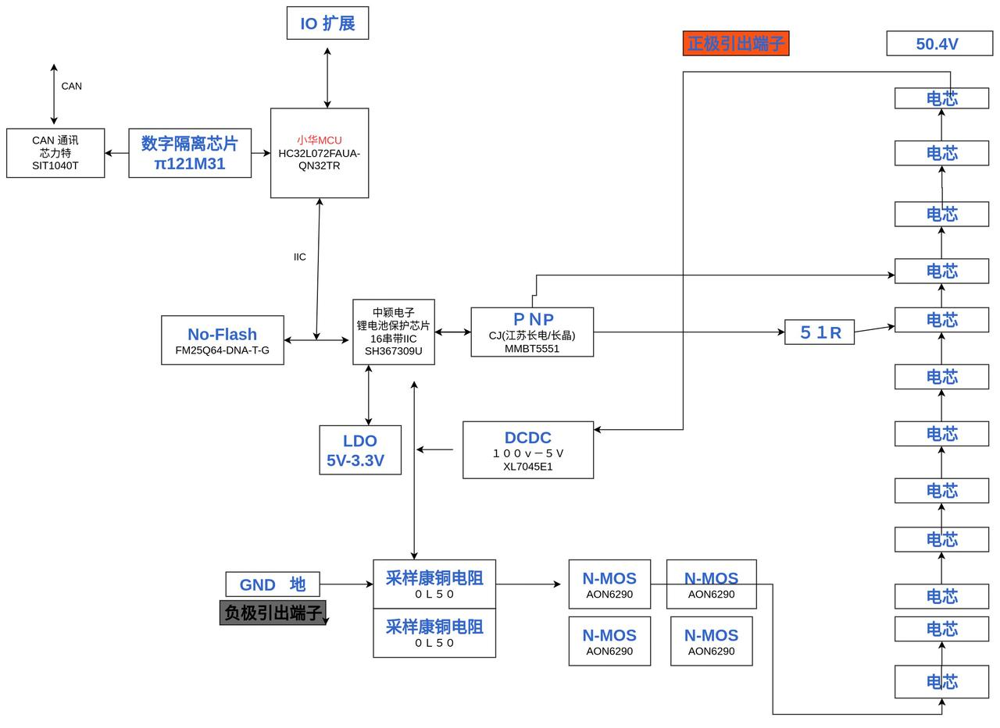

# 前言

本文主要记录和描述电池的BMS软件实现方案

# 一、版本信息

版本号：0.02

创建日期：2023.02.13

创建人：曾建铭

# 二、变更日志

| 时间       | 版本号 | 变更人 | 主要变更内容                                                 |
| ---------- | ------ | ------ | ------------------------------------------------------------ |
| 2023.02.13 | 0.0.1  | 曾建铭 | 初始化文档                                                   |
| 2023.02.21 | 0.1    | 曾建铭 | 完成BMS软件整体较初步的功能目的以及一部分功能大致的实现，提出了一部分功能所需的算法评估 |
|            |        |        |                                                              |

# 三、文档说明

## 名词解释

| **术语/略缩词** | **解释说明**                              |
| --------------- | ----------------------------------------- |
| SOC             | 荷电状态(State of Charge)                 |
| SOP             | 功率状态(State of Power)                  |
| SOH             | 电池劣化程度（State of Health）           |
| FS              | 满量程(Full Scale)                        |
| BMS             | 蓄电池管理系统(Battery Management System) |
| BCU             | 蓄电池控制单元(Battery Control Unit)      |
| DoD             | 放电深度（Depth of discharge）            |

# 四、正文部分

## 4.1硬件部分

硬件采用主控+从控的分布方式

主控MCU:  ST/GD/其他

从控BMU:  SH367309

下图仅做参考

## 4.2软件部分（待更新）

### 整体框架（待更新）

下图电池BMS整体通信框图

下图为电池BMS整体功能框图

下图为电池BMS状态转换逻辑图

### BMS功能分类

整个BMS将功能大体划分为五个部分

分别是***参数采集、保护策略、均衡管理、通信管理和故障系统***

------

#### 参数采集

BMS时刻对电池做相关参数的采集，采集方式通过中断进行。

具体参数采集及频率为：

| 采集参数           | 采集方式   | 采集频率  |
| :----------------- | ---------- | --------- |
| 电池包总电压       | VADC       | 10Hz      |
| 电池包单体电芯电压 | VADC       | 10Hz      |
| 电池包充放电电流   | CADC、VADC | 4Hz、10Hz |
| 监测点温度         | VADC       | 10Hz      |

根据SH367309数据手册

**电芯电压计算方式**为：
$$
V_{CELL} = CELL{x} \times \frac{5}{32}
$$
其中单位为mV，CELLx为一个有符号16bit数据，需要从BCU相应的CELLxH、CELLxL寄存器读取并转换。

**VADC检测电流计算方式**为：
$$
Current = \frac{200 \times CUR}{26837 \times R_{SENSE}}
$$
其中单位为mA，CUR为CUR寄存器的值，Rsense为Sense电阻（单位为Ω）

***特别注意：VADC采集的电流仅作为判断充放电状态使用***

**CADC检测电流计算方式**为：
$$
Current = \frac{200 \times CADCD}{21470 \times R_{SENSE}}
$$
其中单位为mA，CADCD为CADCD寄存器值，Rsense 为Sense电阻，单位为Ω。

需要注意，数据手册上提到CADC在出厂时没有校正，需要软件设定比例参数K与偏移误差Offset。更具体的内容还需要进一步讨论。

**温度计算公式**：
$$
R_{T1} = \frac{TEMPx}{32768-TEMPx} \times R_{REF}
$$
其中Rt1为外部热敏电阻阻值，Rref为内部参考电阻阻值，TEMPx为TEMPx寄存器值，内部参考电阻Rref计算公式为
$$
R_{REF} = 6.8+0x05 \times TR[6:0]
$$

------

#### 保护策略

通过对BCU的控制，实现电压保护、温度保护、电流保护等功能。**具体实现由BCU提供。**

##### 电压保护

电压保护主要包括：过压保护、过压保护恢复、欠压保护、欠压保护恢复、异常高压保护、禁止低压电芯充电保护。（部分功能由BCU提供）

##### 电流保护

电流保护主要指放电过流保护以及短路保护。（部分功能由BCU提供）

##### 温度保护

温度保护主要指充电高温保护、充电低温保护、放电高温保护以及放电低温保护。（部分功能由BCU提供）

##### **充电管理**

充电管理主要包括：预充电、均衡、充电截止、禁止低压电芯充电功能。

充电管理的执行细节由BMU实现，MCU软件开启相应功能即可

预充电电压阈值、禁止低压电芯电压阈值需要配置

##### **放电管理**

放电过程主要侦测以下几个参数：放电截止电压阈值DischargeEndVoltage与放电截止延时时间DischargeEndDelay。

当系统检测到某一单体电芯电压低于放电截止电压阈值Vd，开始计算放电截止时间Td，当放电截止时间Td超过放电截止延时时间Tdelay，则赋予放电截止状态标志位。

##### 重置保护（待定）

电池包电量高于65%并且无任何操作存储10天后（待定），BMS控制电池自放电至电量65%，以保护电池。自放电时间具体待定，不会有LED指示这个过程

------

#### 均衡管理

通过对BCU的控制，实现均衡功能、低功耗状态控制、SOC估算以及SOH估算。

##### **软件均衡**

除去硬件上的均衡电路外，也可开启SH367309内部的均衡功能实现软件均衡，通过判定电芯压差的是否超出阈值选择是否开启，多节电芯均衡时，进行奇偶均衡。

问题在于充电状态下，均衡的开启时机是需要考量的，以下提供一些具体策略：

1.充电过程中全程开启均衡：通过对电流持续检测是否处于充电状态，来选择保持开启均衡模式。此时会持续监测电池包单体电芯电压，但是在均衡过程中对于带载状态的电池的测量误差很大。

2.充电末期开启均衡：在充电状态下，当最高单体电芯的电压触及充电截止电压后，BMU开启均衡，主动放掉电压最高单体部分电量，使系统进一步充入更多电量，直至全部电芯同时达到截止电压。

具体均衡策略还需要仔细考虑

##### **低功耗状态控制**

低功耗状态控制期望通过**降低使用VADC、CADC和TWI通信模块的频率**或者**关闭VADC、CADC和TWI通信模块**，来实现低功耗。考虑到BCU进入IDLE状态与SLEEP状态就会自动关闭VADC功能、CADC功能与TWI通信，因此设想的低功耗状态控制逻辑主要是通过**周期性唤醒BMU并进入IDLE状态**来实现的。

这里设定每10秒（或每20秒）将BMU从IDLE状态下唤醒，采集电压、电流、温度等信息，判断是否触发保护模式，如果没有触发保护模式，则立刻进入IDLE状态并等待下次唤醒。

更具体的策略待定

##### **SOC估算**（待定，重中之重，大部分功能是以SOC估算值为基础的）

由于BCU的容量计精度并不够高（分辨率在5%左右），这里必须考虑在MCU中手动引入SOC的估算方法。

通过**多种SOC估算算法的相互修正来提高SOC的精度和鲁棒性**，同时需要考虑**SOH和温度对SOC估算的精度误差**。

（具体待定，SOC估算肯定是要做的，SOC估算方法比较多，具体的选择也取决于MCU的选型，容我收集资料，仔细评估一下）

##### SOH估算

由于锂离子电池的老化是典型的非线性电化学老化，对电池劣化程度的估算要么基于电化学机理的维度切入，要么基于电池外特性表现的维度切入。前者理论性可行，但实际应用中设计的电池内部电化学特性不易测量。后者需要针对确定的电池模型做模型估算，得到可离线计算的SOC-OCV曲线图，需要花时间去测。

SOH不优先做考虑，容我在收集更多资料。

**SOP估算**

SOP不优先做考虑，容我再收集更多资料。

------

#### 通信管理

##### 通讯容错

1. MCU通过TWI和BMU进行读/写操作时，为了防止通讯被干扰，软件部分需要加强容错处理。主要指写操作时对固定长度的数据写入错误时，通信延时1ms并再次写入。

2. RAM寄存器防护：为了防止BMS在运行过程中，因为短路或者其他原因造成的系统供电不稳定的情况，进而导致的RAM寄存器被复位。需要系统每隔一段时间检测RAM寄存器的状态。

   检测是否存在复位现象有两种方法：

   一、检测RST_FLG标志位（数据手册中，系统上电/软件复位/LVR（低电压复位）都会置位，需要MCU手动清零）

   二、读取RAM控制位数据是否与预设值相同，如有差异，覆写控制位寄存器即可。

3. ...

4. ...

##### 数据采集

VADC：转换频率10Hz，精度13bit

SH367309的VADC转换频率为10Hz， VADC以固有时序采集电芯电压、温度以及电流。
(1) 每1个t cycle 周期内，VADC按照固定的时序采集16通道电压以及1通道电流
(2) 每1S周期内， VADC按照固定的时序采集一次3通道温度

CADC：转换频率4Hz，精度16bit

因此通过设置定时中断来获取VADC、CADC采集到的电池包总电压、电池包单体电芯电压、电池包温度、电池包电流

因为VADC采集电流的频率更高，但精度比CADC低，因此VADC的电流采样仅作为电池包充放电检测的判断条件之一

##### 数据传输

BMS有以下通讯方式：TWI通信、CAN FD通讯、UART通讯和SPI通讯

MCU与BCU间需要使用TWI通信，具体协议见数据手册。

MCU与电源板间需要使用CAN FD通讯，具体协议未定。

MCU与电脑上位机间使用UART通讯，具体协议见数据手册。

MCU与Nor-FLASH之间使用SPI通讯，具体协议见Nor-FLASH数据手册。

------

#### 故障系统

##### 故障定义

故障定义目前划分为三个部分：通信故障、电路故障、电池组故障

1. 通信故障主要指：CAN-FD收发链路故障、WTI收发链路故障、UART收发链路故障 与 SPI收发链路故障

   故障检测的方式以MCU访问收不到ACK后，进行数次重复检测验证即可

2. 电路故障主要指：EEPROM写入读取故障、Nor-Flash写入读取错误、均衡电路损坏等等

3. 电池组故障主要指：

   ​	电池包总电压、电池包单体电芯电压、电池包总电流、电池包测温点等参数不在设定阈值内；

   ​	温差、压差等不在设定阈值内；

   ​	充放电电流过流故障；

具体故障定义还需要参考大量BMS工程和资料，待补充

##### 故障分级

##### 故障处理

出现故障时，将在看门狗线程中将对应的故障码置位，故障处理方式有以下几种：

**报警延时**：为了防止电池在动态工况下由于突变情况而导致故障误报（例如电流、电压、温度参数超过或者低于设定阈值）。检测到故障状态位时，延时一段时间，若再次检测到该故障状态，则将其对应故障状态位置位；

**报警锁定**：一旦故障延时后确定了故障的存在，将根据故障分级的情况来判断是否有必要对故障报警信息进行锁定，直至系统进行重启，其他较低等级的故障将在故障值恢复到阈值内后解除故障报警信息。

**报警信息存储**：一旦故障延时后确定了故障的存在，根据故障分级，对于最高等级的故障信息将被记录EEPROM或者Nor-FLASH

##### BMS系统自检

BMS系统自检会在系统重启时运行一次，检测流程顺序如下：

**通讯链路**：TWI通讯收发链路、SPI通讯收发链路、UART通讯收发链路、CAN-FD通讯收发链路。

~~采样参数：查询一次系统是否正常供低电压。~~（待定）

**读写测试**：读取Nor-FLASH或EEPROM上一次存储的SOC数据和故障状态。计算一次电池SOC

...

...

...

### BMS状态转换

BMS系统状态转换说明：

（1）**系统初始化**：系统上电唤醒后，MCU进行初始化，配置相关定时器、中断等功能，复位系统上次留存的故障状态位。

（2）**系统待机**：在系统初始化结束后，执行一次BMS系统自检（具体内容见BMS系统自检），自检发现故障则根据故障分级进行相应报警处理。否则等待接下来的命令。

（3）**系统正常运行**：MCU与BCU正常运行，进行数据采集、信息交互以及故障判断与报警，通过CAN-FD、UART来对机器人电源板和上位机做反馈。

（4）**系统故障模式**：触发故障根据故障等级进行相应处理，决策并执行、反馈相应的报警信息。

（5）**系统下电关机（省电模式）**：接受电源板下电关机命令后，BMS会计算电池SOC，查询故障状态位并写入EEPROM或Nor-Flash，以供后续查看及使用。随后MCU控制BCU进入低功耗模式（具体见低功耗策略）

### 参数标定与误差修正