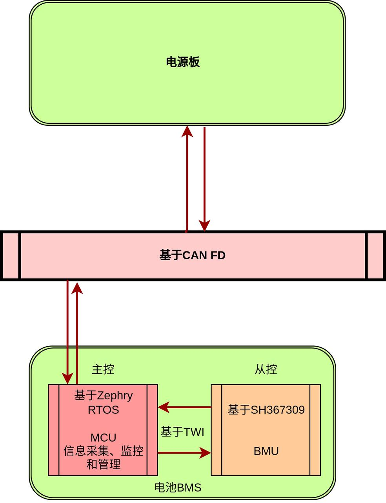

# 前言

本文主要记录和描述电池的BMS软件实现方案

# 一、版本信息

版本号：0.00

创建日期：2023.02.13

创建人：曾建铭

# 二、变更日志

# 三、文档说明

## 名词解释

| **术语/略缩词** | **解释说明**                              |
| --------------- | ----------------------------------------- |
| SOC             | 荷电状态(State of Charge)                 |
| SOP             | 功率状态(State of Power)                  |
| SOH             | 电池劣化程度（State of Health）           |
| FS              | 满量程(Full Scale)                        |
| BMS             | 蓄电池管理系统(Battery Management System) |
| BCU             | 蓄电池控制单元(Battery Control Unit)      |
| DoD             | 放电深度（Depth of discharge）            |

# 四、正文部分

## 4.1硬件部分

硬件采用主控+从控的分布方式

主控MCU:  ST/GD/其他

从控BMU:  SH367309

## 4.2软件部分（待更新）

### 整体框架

下图电池BMS整体通信框图

下图为电池BMS整体功能框图

下图为电池BMS逻辑模型框图

### BMS功能分类

整个BMS将功能大体划分为五个部分

分别是***参数采集、保护策略、均衡管理、通信管理和故障系统***

#### 参数采集

BMS时刻对电池做相关参数的采集，采集方式通过中断进行。

具体参数采集及频率为：

| 采集参数           | 采集方式   | 采集频率  |
| :----------------- | ---------- | --------- |
| 电池包总电压       | VADC       | 10Hz      |
| 电池包单体电芯电压 | VADC       | 10Hz      |
| 电池包充放电电流   | CADC、VADC | 4Hz、10Hz |
| 监测点温度         | VADC       | 10Hz      |

根据SH367309数据手册

**电芯电压计算方式**为：
$$
V_{CELL} = CELL{x} \times \frac{5}{32}
$$
其中单位为mV，CELLx为一个有符号16bit数据，需要从BCU相应的CELLxH、CELLxL寄存器读取并转换。

**VADC检测电流计算方式**为：
$$
Current = \frac{200 \times CUR}{26837 \times R_{SENSE}}
$$
其中单位为mA，CUR为CUR寄存器的值，Rsense为Sense电阻（单位为Ω）

***特别注意：VADC采集的电流仅作为判断充放电状态使用***

**CADC检测电流计算方式**为：
$$
Current = \frac{200 \times CADCD}{21470 \times R_{SENSE}}
$$
其中单位为mA，CADCD为CADCD寄存器值，Rsense 为Sense电阻，单位为Ω

**温度计算公式**：
$$
R_{T1} = \frac{TEMPx}{32768-TEMPx} \times R_{REF}
$$
其中Rt1为外部热敏电阻阻值，Rref为内部参考电阻阻值，TEMPx为TEMPx寄存器值，内部参考电阻Rref计算公式为
$$
R_{REF} = 6.8+0x05 \times TR[6:0]
$$

#### 保护策略

通过对BCU的控制，实现电压保护、温度保护、电流保护等功能。**具体实现由BCU提供。**

##### 电压保护

电压保护主要包括：过压保护、过压保护恢复、欠压保护、欠压保护恢复、异常高压保护、禁止低压电芯充电保护。

##### 电流保护

电流保护主要指放电过流保护以及短路保护。

##### 温度保护

温度保护主要指充电高温保护、充电低温保护、放电高温保护以及放电低温保护。

#### 均衡管理

通过对BCU的控制，实现软件均衡、低功耗状态控制、充电管理、放电管理、SOC估算以及SOH估算。

##### **软件均衡**

##### **低功耗状态控制**

##### **充电管理**

##### **放电管理**

##### **SOC估算**

由于BCU的容量计精度并不够高（分辨率在5%左右），这里考虑在MCU中手动引入两种SOC的估算方法，分别为安时积分和基于KF的SOC估算算法。(具体未定，也许是我想复杂了，具体的SOC估算还是需要考虑MCU的性能的)

##### SOH估算

#### 通信管理

#### 故障系统

### BMS状态转换

### 参数标定与误差修正