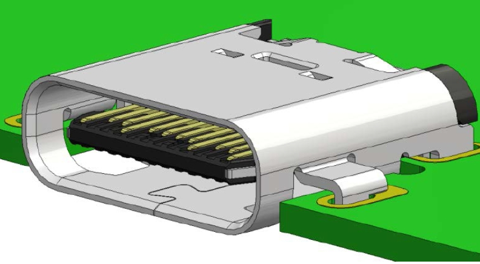
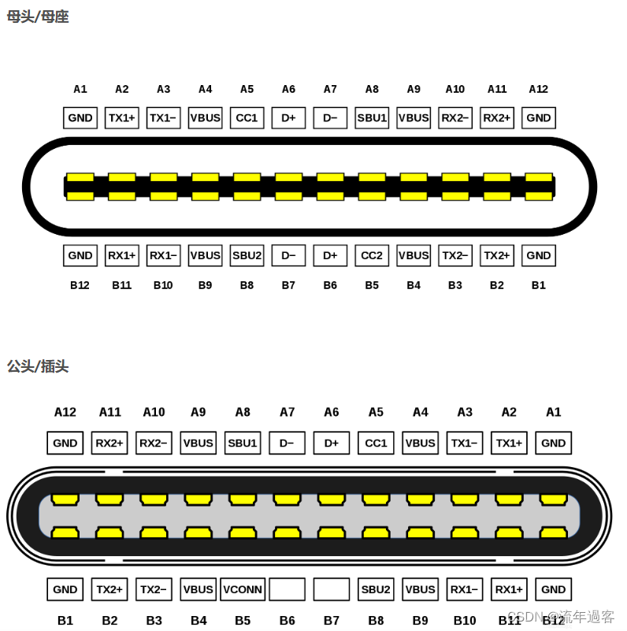
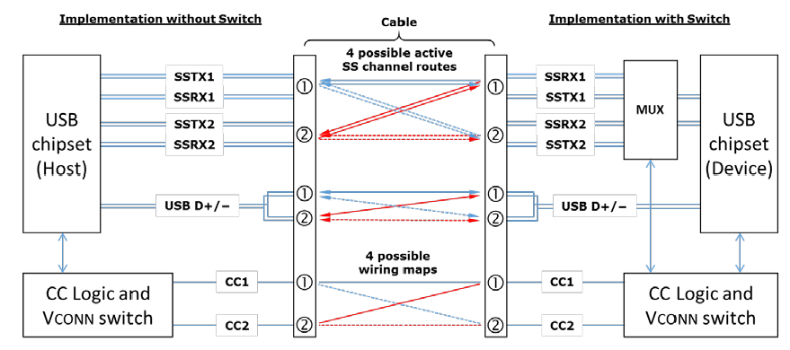
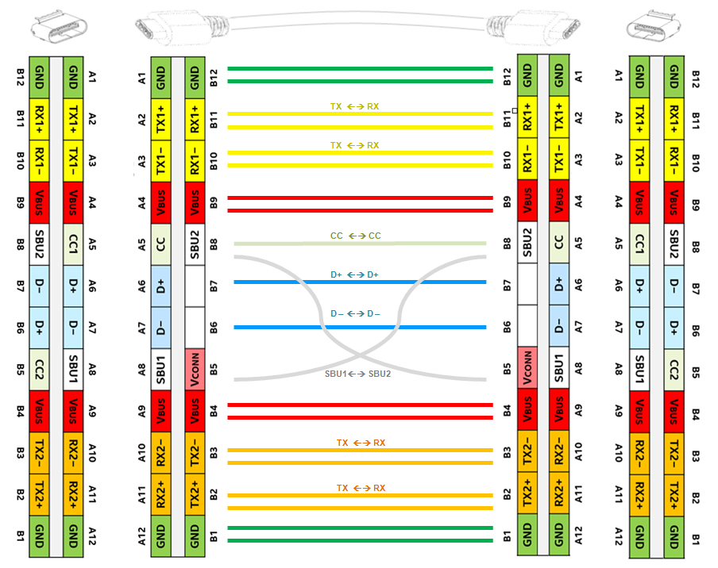
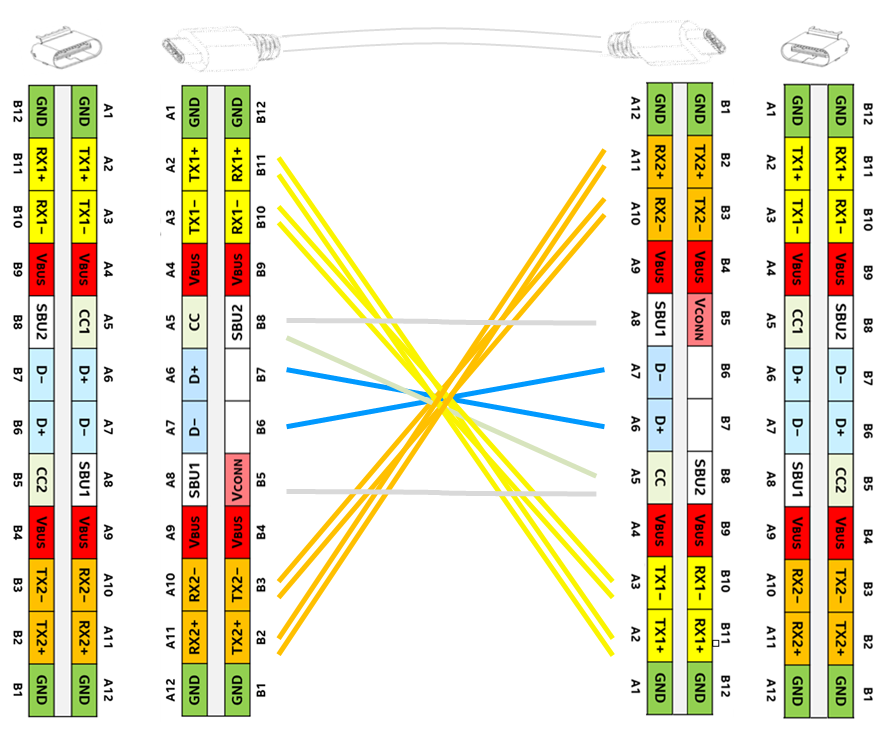

# 电源板开发记录

***本文的主要目的是记录A2机器人电源板相关外设的开发情况和方案的记录与评估***

***本文部分内容会大量参考网上分享的相关文档和工程***

## 快充模块

使用USB-PD（**Power Delivery**）3.0 协议实现快充，该协议基于TypeC接口。

### Type-C简单介绍

Type-C是USB接口的一种形式，不分正反两面均可插入，支持USB标准的充电、数据传输、视频传输、音频传输、显示输出等功能。

因此需要了解Type-C接口的一些基本信息，Type-C插头（公头）和母座（母头），每个均有24个引脚。如下图所示

具体的引脚定义如下:

| Pin  | 名称   | Function                       | Pin                              | 名称   | Function                       |
| :--: | ------ | ------------------------------ | -------------------------------- | ------ | ------------------------------ |
|  A1  | GND    | 接地                           | B12                              | GND    | 接地                           |
|  A2  | SSTXp1 | SuperSpeed差分信号#1，TX，正   | B11                              | SSRXp1 | SuperSpeed差分信号#1，RX，正   |
|  A3  | SSTXn1 | SuperSpeed差分信号#1，TX，负   | B10                              | SSRXn1 | SuperSpeed差分信号#1，RX，负   |
|  A4  | VBUS   | 总线电源                       | B9                               | VBUS   | 总线电源                       |
|  A5  | CC1    | Configuration channel          | B8                               | SBU2   | Sideband use                   |
|  A6  | Dp1    | USB2.0差分信号，position 1，正 | B7                               | Dn2    | USB2.0差分信号，position 2，负 |
|  A7  | Dn1    | USB2.0差分信号，position 1，负 | USB2.0差分信号，position 1，正B6 | Dp2    | USB2.0差分信号，position 2，正 |
|  A8  | SBU1   | Sideband use                   | B5                               | CC2    | Configuration channel          |
|  A9  | VBUS   | 总线电源                       | B4                               | VBUS   | 总线电源                       |
| A10  | SSRXn2 | SuperSpeed差分信号#2，RX，负   | B3                               | SSTXn2 | SuperSpeed差分信号#2，RX，负   |
| A11  | SSRXp2 | SuperSpeed差分信号#2，RX，正   | B2                               | SSTXp2 | SuperSpeed差分信号#2，RX，正   |
| A12  | GND    | 接地                           | B1                               | GND    | 接地                           |

简单来说，Type-C口有4对TX/RX分线，2对USBD+/D-，一对SBU，2个CC，另外还有4个VBUS和4个地线。并且以镜像反转的形式排布，因此不论正反接，线序永远对应；同时，也正因为线序永远对应，**需要连接起来的设备相互进行通信以确定自己是主机还是外设**。

传输方式：

1. 当Type-C接口仅用作传输DP信号时，则可利用4对TX/RX，从而实现4Lane传输，这种模式称为DPonly模式；
2. Type-C还保留了USB D+/D-，用以接USB2.0设备，同时使用USB D+/D-和上面的DPonly模式配合可实现DP+USB2.0模式；
3. 正常来说USB3.0只需要使用2对TX/RX、USB2.0只需要使用一对D+/D-，所以Type-C接口中总会有一半的接口是多余的；而DP的交替模式则是将DP的差分信号加载到2对“多余”的TX/RX上面，所以也可实现USB3.0+DP的模式。

type-C接口上的A5和B5的CC线是用以和设备通讯（通讯方式：单线归零码），以识别当前接口是正插或者反插；

两条SBU线则是在DP功能开启时，作为DP协议中的AUX_P/N差分对（它的极性是可以根据正反插方向修改的），用以传输DPCD、EDID等信息。

RX/TX数据线需要使用多路复用器针对各种可能的电缆连接状态对RX/TX线的连接状态进行配置，使得正确的通讯连接能够形成；通过测量每个端子上CC1/2的状态即可了解电缆和插座的方向，CC逻辑控制器可据此完成多路复用器的路由配置，此工作既可在多路复用器中完成，也可能在USB芯片组中进行。

从下图可以看出，无论是正插还是反插，对于线材两端的typeC母座接口而言，总是可以通过对CC线做识别使所有的接口线对应。

### USB-PD3.0(Power Delivery)充电协议介绍

PD3.0 （Power Delivery）是基于USB Type-C的一种电源供电标准，最大供电功率能够达到100瓦（20V5A）；

USB-PD协议就是通过对Type-C的“配置通道引脚CC”进行通讯的。通讯针对数据和电源分别进行，此通讯会在线材接口连接后的立刻进行。

数据通讯方面：用于数据通讯的主机端口被称为下行端口（Downstream Facing Port, DFP），外设端口被称为上行端口（Upstream Facing Port, UFP）。

电源传输方面：供电端设备被称为源端（Source），耗电端设备被称为吸收端（Sink)。两个外设连接在一起时，CC线在两台设备连接时通过通讯来确定Source设备和Sink设备。

新的USB PD 3.0协议还支持可编程电源 (Programmable Power Supply, PPS) 协议，容许对总线电压和电流进行精确调节。
